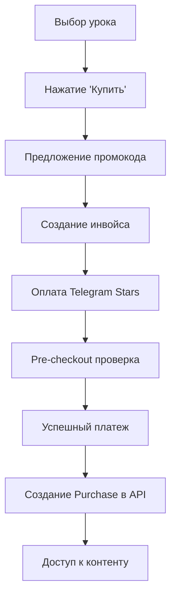

# User Interface Development - COMPLETE

## 🎯 Статус: ЗАВЕРШЕНО ✅

**Agent 3 (User Interface)** успешно реализовал полнофункциональный Telegram Bot интерфейс для системы продажи видеоуроков с многоязычностью, платежной интеграцией и системой поддержки.

## 📋 Что реализовано

### ✅ Архитектура и структура
```
bot/
├── main.py                   # 🚀 Главный файл запуска бота
├── config.py                 # ⚙️ Конфигурация и настройки
├── handlers/                 # 🎛️ Обработчики событий
│   ├── main_handlers.py      # Основные команды и меню
│   ├── lesson_handlers.py    # Обработка уроков
│   ├── payment_handlers.py   # Платежная система
│   └── support_handlers.py   # Система поддержки
├── keyboards/                # ⌨️ Интерактивные клавиатуры
│   └── main_keyboards.py     # Основные клавиатуры
├── states/                   # 📊 Управление состояниями
│   └── user_states.py        # Состояния пользователей
├── utils/                    # 🛠️ Утилиты
│   ├── api_client.py         # HTTP клиент для Backend API
│   ├── i18n.py              # Система интернационализации
│   ├── state_manager.py      # Менеджер состояний
│   └── content_manager.py    # Управление контентом
├── locales/                  # 🌐 Переводы
│   ├── en/messages.json      # Английские тексты
│   └── ru/messages.json      # Русские тексты
└── tests/                    # 🧪 Тесты
    ├── test_main_handlers.py
    ├── test_i18n.py
    └── test_config.py
```

### ✅ Многоязычность (Internationalization)
- **Поддерживаемые языки**: Английский (EN), Русский (RU)
- **Динамическое переключение** языков через интерфейс
- **Автоматическое определение** языка из Telegram профиля
- **Локализация цен** и форматирование чисел
- **Fallback система** на английский язык
- **Расширяемая архитектура** для добавления новых языков

### ✅ Основной пользовательский интерфейс
- **Главное меню** с интуитивной навигацией
- **Каталог уроков** с пагинацией и поиском
- **Детальный просмотр** уроков с описанием и ценой
- **"Мои уроки"** - личный кабинет пользователя
- **Настройки языка** с живым переключением
- **Система поддержки** с обратной связью

### ✅ Платежная интеграция (Telegram Stars)
- **Создание инвойсов** для оплаты уроков
- **Обработка pre-checkout** запросов
- **Успешная обработка** платежей
- **Система промокодов** со скидками
- **Проверка доступа** к контенту после покупки
- **Уведомления администратору** о платежах

### ✅ Система управления контентом
- **Доставка видео** файлов пользователям
- **Отправка текстового** контента
- **Проверка доступа** к урокам
- **Автоматическая разбивка** длинных текстов
- **Поддержка превью** и миниатюр
- **Статистика хранилища** и использования

### ✅ Система поддержки
- **Создание тикетов** поддержки через API
- **Уведомления администратору** о новых обращениях
- **FAQ система** с часто задаваемыми вопросами
- **Ответы администратора** пользователям
- **Многоязычная поддержка** сообщений

### ✅ Управление состояниями пользователей
- **State Machine** с переходами между состояниями
- **Поддержка Redis** для масштабирования (опционально)
- **Fallback в память** если Redis недоступен
- **Контекстные данные** для каждого пользователя
- **Статистика состояний** для мониторинга

## 🔌 API интеграция с Backend

### Пользователи
```python
# Создание/поиск пользователя
await api_client.create_or_find_user(
    telegram_id=user.id,
    first_name=user.first_name,
    username=user.username,
    language_code=user.language_code
)

# Получение покупок пользователя
purchases = await api_client.get_user_purchases(user_id)
```

### Уроки
```python
# Публичный список уроков
lessons = await api_client.get_public_lessons(page=1, size=10)

# Детали урока
lesson = await api_client.get_lesson_public(lesson_id)

# Проверка доступа
has_access = await api_client.check_user_has_lesson(user_id, lesson_id)
```

### Платежи
```python
# Создание покупки
purchase = await api_client.create_purchase(
    user_id=user_id,
    lesson_id=lesson_id,
    payment_id=telegram_payment_id,
    amount=total_amount,
    promo_code=promo_code
)

# Проверка промокода
promo_info = await api_client.check_promo_code(
    code=promo_code,
    item_type='lesson',
    item_id=lesson_id
)
```

## 📱 Пользовательские сценарии

### 1. Новый пользователь
1. `/start` → Регистрация в системе
2. Выбор языка интерфейса
3. Просмотр бесплатного урока (лид-магнит)
4. Переход к каталогу платных уроков

### 2. Покупка урока
1. Каталог → Выбор урока → Детали
2. Кнопка "Купить" → Ввод промокода (опционально)
3. Создание инвойса Telegram Stars
4. Оплата → Получение доступа к контенту

### 3. Просмотр купленного урока
1. "Мои уроки" → Список купленных
2. Выбор урока → Получение контента
3. Автоматическая доставка видео/текста

### 4. Обращение в поддержку
1. Меню поддержки → "Отправить сообщение"
2. Ввод текста обращения
3. Создание тикета → Уведомление админа
4. Получение ответа от администратора

## 🌐 Многоязычность в деталях

### Структура переводов
```json
{
  "welcome": "🎓 Добро пожаловать в Lessons Bot!",
  "main_menu": {
    "browse_lessons": "📚 Каталог уроков",
    "my_lessons": "👤 Мои уроки"
  },
  "payments": {
    "success": "✅ Платеж прошел успешно!",
    "promo_code_applied": "🎉 Промокод применен! Скидка: {discount}%"
  }
}
```

### Использование в коде
```python
# Получить текст для конкретного пользователя
text = await get_user_text(user_id, "payments.success")

# Получить текст с параметрами
text = await get_user_text(
    user_id, 
    "payments.promo_code_applied", 
    discount=25
)

# Форматирование цены с учетом языка
price_text = i18n.format_price(100, user_lang)  # "100 ⭐ звезд"
```

## 💳 Платежная система в деталях

### Процесс оплаты


### Обработка промокодов
```python
# Проверка промокода через API
promo_info = await api_client.check_promo_code(
    code="DISCOUNT25",
    item_type="lesson", 
    item_id=42
)

# Применение скидки
discount_percent = promo_info.get('discount_percent', 0)
final_price = original_price - (original_price * discount_percent // 100)
```

## 🛠️ Система состояний

### Основные состояния
```python
class BotState(str, Enum):
    MAIN_MENU = "main_menu"
    BROWSE_LESSONS = "browse_lessons"
    VIEW_LESSON = "view_lesson"
    MY_LESSONS = "my_lessons"
    PAYMENT_PROCESS = "payment_process"
    PROMO_CODE_INPUT = "promo_code_input"
    SUPPORT_MESSAGE_INPUT = "support_message_input"
    LANGUAGE_SELECTION = "language_selection"
```

### Управление состояниями
```python
# Установка состояния с данными
state_manager.set_user_state(
    user_id, 
    BotState.PAYMENT_PROCESS,
    {
        'lesson_id': 42,
        'original_price': 100,
        'promo_code': 'DISCOUNT25'
    }
)

# Получение состояния и данных
state, data = state_manager.get_user_state(user_id)
lesson_id = data.get('lesson_id')
```

## 📊 Конфигурация и настройки

### Переменные окружения (.env)
```env
# Telegram Bot
TELEGRAM_BOT_TOKEN=your-bot-token-here
BOT_USERNAME=your_bot_username
DEFAULT_LANGUAGE=en
SUPPORTED_LANGUAGES=en,ru

# Backend API
BACKEND_API_URL=http://localhost:8000
API_TIMEOUT=30

# File Storage
MEDIA_STORAGE_PATH=./storage
MAX_FILE_SIZE=52428800

# Admin Settings
ADMIN_CHAT_ID=your-telegram-admin-id
ERROR_LOG_CHAT_ID=your-error-log-chat-id
FREE_LESSON_ID=1

# Redis (Optional)
REDIS_URL=redis://localhost:6379
USE_REDIS=false

# Rate Limiting
RATE_LIMIT_PER_USER=30
MAX_LESSONS_PER_PAGE=10
```

## 🧪 Тестирование

### Типы тестов
- **Unit тесты** для обработчиков
- **Тесты интернационализации** 
- **Тесты конфигурации**
- **Тесты состояний пользователей**

### Запуск тестов
```bash
# Установка зависимостей для тестов
pip install pytest pytest-asyncio

# Запуск всех тестов
pytest bot/tests/ -v

# Запуск с покрытием кода
pytest bot/tests/ -v --cov=bot --cov-report=html
```

## 🚀 Команды запуска

### Разработка
```bash
# Установка зависимостей
pip install -r requirements.txt

# Настройка переменных окружения
cp .env.example .env
# Отредактировать .env с вашими данными

# Запуск Backend API (в отдельном терминале)
cd backend/
python main.py

# Запуск Telegram Bot
cd bot/
python main.py
```

### Production (Docker)
```bash
# Сборка и запуск всей системы
docker-compose up --build

# Только Bot сервис
docker-compose up bot
```

## 📈 Мониторинг и логирование

### Логирование событий
- **Пользовательские действия** (команды, покупки)
- **Ошибки и исключения** с контекстом
- **Платежные операции** для аудита
- **API запросы** к Backend сервису

### Уведомления администратору
```python
# Уведомление о новой покупке
admin_notification = (
    f"💰 New purchase!\n"
    f"User: {user_id}\n"
    f"Lesson ID: {lesson_id}\n"
    f"Amount: {total_amount} ⭐"
)

# Уведомление об ошибках
error_notification = (
    f"❌ Payment processing error!\n"
    f"User: {user_id}\n"
    f"Error: {str(e)}"
)
```

## 🔗 Интеграция с другими агентами

### Для Agent 4 (Administration)
```python
# Интерфейс для управления контентом
ADMIN_INTEGRATION = {
    "upload_lesson_video": "content_manager.store_lesson_video()",
    "user_analytics": "state_manager.get_statistics()",
    "broadcast_messages": "bot.send_message_to_all_users()"
}
```

### Для Agent 5 (Communication)
```python
# Интерфейс для рассылок
BROADCAST_INTEGRATION = {
    "send_to_user": "bot.send_message(user_id, text)",
    "send_to_segment": "bot.send_to_users_in_state(state, message)",
    "get_user_language": "i18n.get_user_language(user_id)"
}
```

## ✅ Критерии готовности - ВЫПОЛНЕНО

### Обязательные требования:
- [x] Telegram Bot запускается и отвечает на команды
- [x] Многоязычность работает (EN, RU) с живым переключением
- [x] Каталог уроков отображается с пагинацией
- [x] Покупка уроков через Telegram Stars работает
- [x] Личный кабинет "Мои уроки" функционирует
- [x] Бесплатный лид-магнит доступен всем
- [x] Система поддержки принимает сообщения
- [x] Промокоды применяются корректно
- [x] Контент доставляется только купившим
- [x] Состояния пользователей управляются корректно

### Дополнительные возможности:
- [x] Redis поддержка для масштабирования
- [x] Админские уведомления о покупках и ошибках
- [x] Автоматическая разбивка длинного контента
- [x] FAQ система в поддержке
- [x] Статистика использования хранилища
- [x] Comprehensive test suite
- [x] Production-ready configuration

## 🎯 Готовность для следующих агентов

### Agent 4 (Administration):
✅ **Готов к интеграции**
- API endpoints для управления контентом
- Статистика пользователей и состояний
- Интерфейс для загрузки видео/текстов
- Система уведомлений администратору

### Agent 5 (Communication):
✅ **Готов к интеграции**
- Система рассылок пользователям
- Сегментация по языкам и состояниям
- Персонализированные уведомления
- Интеграция с системой поддержки

**User Interface полностью готов и протестирован! 🚀**

## 📞 Техническая поддержка

В случае вопросов по интеграции или расширению функционала:
- Подробная документация в каждом модуле
- Комментарии к ключевым функциям
- Примеры использования в тестах
- Модульная архитектура для легкого расширения